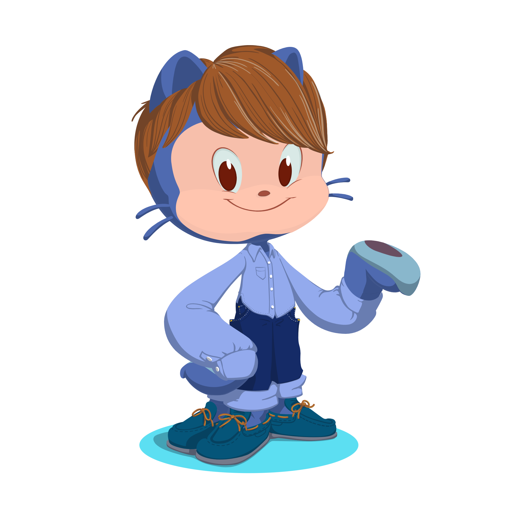

## Olá a todos!!

Meu nome é Richard, e estou no Github para aprender a programar e compartilhar os meus projetos.

- 🇧🇷
- 18y
- Gostaria de aprender a falar Japonês e Inglês
- Pokémon & Beastars fan

## Estou aprendendo

 

## Redes Sociais

 heigth:50px; width:50px
